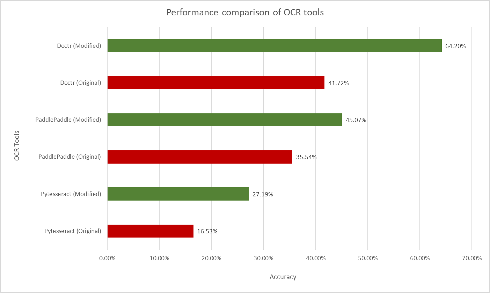
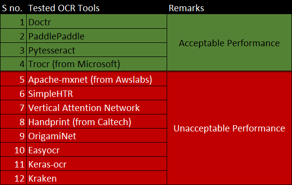

An optical character recognition (OCR) software which excels in reading handwritten English text. It leverages modified versions of various pre-existing OCR technologies like DocTR, PaddleOCR, PyTesseract, and TrOCR which have been stacked to create an optimal pipeline to improve significantly overall performance. To accomplish this, I had to identify the best combination of OCR tools that maximized detection and recognition accuracy, so I started by creating an evaluation module. After this, I iteratively trained machine learning models by finetuning training parameters to achieve the final product.

This system was able to outperform the best available free tools by a remarkable 22%. This is illustrated in the following diagram.

The detailed performance report of these tools can be found in their corresponding eval.json files which are located in the eval_output folder.

Various pre-existing OCR tools were researched for this project. They are listed in the following table.
 

Author: Nalin Malla 
Additional Credit: Thank you Mr. Aayush Baral for training initial version of custom paddle detection model.